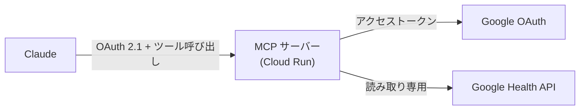

# google-health-mcp

**Google Fitbit Air の健康データを、Google Health API 経由で Claude から呼び出すリモート MCP サーバー。**

[](https://github.com/ryotanakata/google-health-mcp/actions/workflows/ci.yml)


[English README](README.md)

---

Claude に「昨日の睡眠はどうだった？」と聞くと、このサーバーが Google Health API からデータを取り、要約して返す。Fitbit・Pixel Watch のデータも同じように扱える。

## 構成



- サーバー自身が Claude 向けの OAuth 2.1 認可サーバーを兼ねる。同意画面でパスフレーズ（`MCP_SHARED_SECRET`）を入力したときだけトークンを発行する
- 状態を持たない。トークンは署名付き JWT なので DB は不要
- 生の時系列データではなく、要約を返す

## MCP ツール

| ツール | 引数 | 返却内容 |
| --- | --- | --- |
| `get_daily_activity` | `date` | 歩数・消費カロリー・移動距離・アクティブ時間 |
| `get_sleep_log` | `date` | その日の朝に終わった睡眠：睡眠時間・効率・ステージ・仮眠 |
| `get_heart_rate_summary` | `date` | 安静時心拍数・心拍ゾーン別の滞在時間 |
| `get_exercise_history` | `start_date`, `end_date` | ワークアウト：種目・時間・カロリー・平均心拍・距離 |

日付は `YYYY-MM-DD`。期間は両端を含む。

## データ取得の制約

- 1リクエストの期間は最大90日（心拍・カロリーの複数日集計は14日）。長い期間は分割して取得・結合する
- 結果はページ単位（ワークアウト・睡眠は1ページ25件）で、最後まで取得する
- Google 独自のスコア（睡眠スコア、Daily Readiness）は API では取得できない
- Google Health Premium の契約は前提にしていない。契約なしでの取得は実機で未確認

## クイックスタート

```bash
pip install -r requirements-dev.txt
cp .env.example .env                                     # 値を設定する
python auth_setup.py --client-secret client_secret.json  # GOOGLE_REFRESH_TOKEN を取得
python -m src.main                                       # http://localhost:8080/mcp
```

| 変数 | 説明 |
| --- | --- |
| `PUBLIC_BASE_URL` | サーバーの公開オリジン |
| `MCP_SHARED_SECRET` | 同意画面のパスフレーズ（長いランダム値） |
| `MCP_TOKEN_SIGNING_KEY` | トークンの署名鍵（32文字以上のランダム値。パスフレーズとは別の値にする。変更すると全トークンが無効になる） |
| `GOOGLE_CLIENT_ID` / `GOOGLE_CLIENT_SECRET` | GCP の OAuth クライアント |
| `GOOGLE_REFRESH_TOKEN` | `auth_setup.py` の出力 |

## デプロイ

1. Google Cloud で Google Health API を有効化し、読み取り専用スコープで OAuth 同意画面を設定して `client_secret.json` を取得する
2. ローカルで `auth_setup.py` を実行し、秘密情報を Secret Manager に登録する
3. Cloud Run にデプロイし、発行された URL を `PUBLIC_BASE_URL` に設定して再デプロイする
4. Claude の Settings → Connectors → Add custom connector に `https://<サービス>.run.app/mcp` を登録し、同意画面でパスフレーズを入力する

## 開発

```bash
ruff check .
pytest
```

コーディング規約は `.claude/rules/` にある。コミット前に規約レビュー（`rules-review` スキル）を通す。

## ライセンス

MIT
