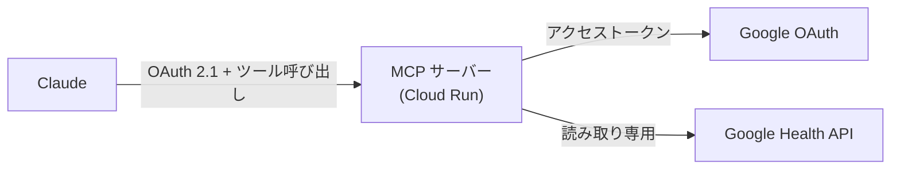

# google-health-mcp

**Google Fitbit Air の健康データを、Google Health API 経由で Claude から呼び出すリモート MCP サーバー。**

[](https://github.com/ryotanakata/google-health-mcp/actions/workflows/ci.yml)


[English README](README.md)

---

Claude に「昨日の睡眠はどうだった？」と聞くと、このサーバーが Google Health API からデータを取り、要約して返す。Fitbit・Pixel Watch のデータも同じように扱える。

## 構成



- サーバー自身が Claude 向けの OAuth 2.1 認可サーバーを兼ねる。同意画面でパスフレーズ（`MCP_SHARED_SECRET`）を入力したときだけトークンを発行する
- 状態を持たない。トークンは署名付き JWT なので DB は不要
- 生の時系列データではなく、要約を返す

## MCP ツール

| ツール | 引数 | 返却内容 |
| --- | --- | --- |
| `get_daily_activity` | `date` | 歩数・消費カロリー・移動距離・アクティブ時間 |
| `get_sleep_log` | `date` | その日の朝に終わった睡眠：睡眠時間・効率・ステージ・仮眠 |
| `get_heart_rate_summary` | `date` | 安静時心拍数・心拍ゾーン別の滞在時間 |
| `get_exercise_history` | `start_date`, `end_date` | ワークアウト：種目・時間・カロリー・平均心拍・距離 |

日付は `YYYY-MM-DD`。期間は両端を含み、最大366日。

## データ取得の制約

- 1リクエストの期間は最大90日（心拍・カロリーの複数日集計は14日）。長い期間は分割して取得・結合する
- 結果はページ単位（ワークアウト・睡眠は1ページ25件）で、最後まで取得する
- Google 独自のスコア（睡眠スコア、Daily Readiness）は API では取得できない
- 睡眠・ワークアウトの開始・終了時刻は、各セッションに記録された現地時刻で返す
- 実機（Google Fitbit Air のアカウント）で動作を確認済み。Google Health Premium の契約は前提にしていないが、契約なしで全データ型を取得できるかは未確認

## クイックスタート

```bash
pip install -r requirements-dev.txt
cp .env.example .env                                     # 値を設定する
python auth_setup.py --client-secret client_secret.json  # GOOGLE_REFRESH_TOKEN を取得
python -m src.main                                       # http://localhost:8080/mcp
```

| 変数 | 説明 |
| --- | --- |
| `PUBLIC_BASE_URL` | サーバーの公開オリジン |
| `MCP_SHARED_SECRET` | 同意画面のパスフレーズ（長いランダム値） |
| `MCP_TOKEN_SIGNING_KEY` | トークンの署名鍵（32文字以上のランダム値。パスフレーズとは別の値にする。変更すると全トークンが無効になる） |
| `GOOGLE_CLIENT_ID` / `GOOGLE_CLIENT_SECRET` | GCP の OAuth クライアント |
| `GOOGLE_REFRESH_TOKEN` | `auth_setup.py` の出力 |

## デプロイ

1. Google Cloud で Google Health API を有効化する。OAuth 同意画面（ユーザーの種類は**外部**）に `GOOGLE_HEALTH_SCOPES` の読み取り専用スコープ3つを追加し、公開ステータスは**「テスト」のまま**にして、自分の Google アカウントをテストユーザーに登録する。Google の審査や Web サイトは不要だが、refresh_token は7日で失効する（後述）
2. 種類が**「デスクトップアプリ」**の OAuth クライアントを作り、JSON をリポジトリ直下に `client_secret.json` として置く（`.gitignore` 済み）
3. `python auth_setup.py --client-secret client_secret.json` を実行し、4つの秘密情報を Secret Manager に登録する。値は入力待ちの画面に貼り付け、コマンド履歴に残さない（macOS 標準の zsh の書き方。bash では `read -rsp "クライアントシークレット: " V`）:
   ```bash
   printf '%s' "$(openssl rand -hex 24)" | gcloud secrets create MCP_SHARED_SECRET --data-file=-
   printf '%s' "$(openssl rand -hex 32)" | gcloud secrets create MCP_TOKEN_SIGNING_KEY --data-file=-
   read -rs "V?クライアントシークレット: "; printf '%s' "$V" | gcloud secrets create GOOGLE_CLIENT_SECRET --data-file=-; unset V
   read -rs "V?refresh_token: "; printf '%s' "$V" | gcloud secrets create GOOGLE_REFRESH_TOKEN --data-file=-; unset V
   ```
   パスフレーズは `gcloud secrets versions access latest --secret=MCP_SHARED_SECRET` で取り出し、パスワードマネージャーに保存する。続けて `<プロジェクト番号>-compute@developer.gserviceaccount.com` に `roles/secretmanager.secretAccessor` を付与し、Cloud Run がシークレットを読めるようにする
4. 1回でデプロイする。Cloud Run の URL は `https://<サービス名>-<プロジェクト番号>.<リージョン>.run.app` で事前に決まり、`PUBLIC_BASE_URL` がないとサーバーは起動しない:
   ```bash
   gcloud run deploy google-health-mcp --source . --region asia-northeast1 --allow-unauthenticated \
     --set-env-vars "PUBLIC_BASE_URL=https://google-health-mcp-<プロジェクト番号>.asia-northeast1.run.app,GOOGLE_CLIENT_ID=<クライアントID>" \
     --set-secrets "MCP_SHARED_SECRET=MCP_SHARED_SECRET:latest,MCP_TOKEN_SIGNING_KEY=MCP_TOKEN_SIGNING_KEY:latest,GOOGLE_CLIENT_SECRET=GOOGLE_CLIENT_SECRET:latest,GOOGLE_REFRESH_TOKEN=GOOGLE_REFRESH_TOKEN:latest"
   ```
   `--allow-unauthenticated` は URL に到達できるようにするだけで、`/mcp` は OAuth で保護される。起動すると `curl <URL>/.well-known/oauth-authorization-server` が JSON を返す
5. Claude の Settings → Connectors → Add custom connector に `<URL>/mcp` を登録し、同意画面でパスフレーズを入力する

コードを更新したときは、`--source . --region asia-northeast1` だけを付けて同じ `gcloud run deploy` を実行する。環境変数とシークレットは引き継がれる。

### Google のトークンの更新（同意画面が「テスト」のとき）

OAuth 同意画面の公開ステータスが「テスト」のままだと、Google の refresh_token は発行から7日で失効する。`scripts/refresh_google_token.sh` は、Secret Manager の最新のトークンが発行から5日経っていればブラウザを開いて再認可し（「許可」を押すのは人）、新しいトークンの登録・Cloud Run への反映・古い版の破棄までを行う。

```bash
scripts/refresh_google_token.sh           # 発行から5日以上なら更新する
scripts/refresh_google_token.sh --force   # 今すぐ更新する
scripts/install_refresh_schedule.sh       # macOS: launchd で毎日21時に確認する
```

## 開発

```bash
ruff check .
pytest
```

コーディング規約は `.claude/rules/` にある。コミット前に規約レビュー（`rules-review` スキル）を通す。

## ライセンス

MIT
