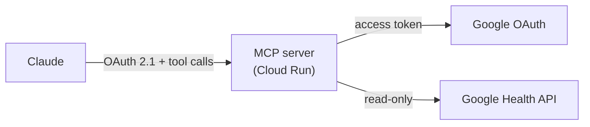

# google-health-mcp

**A remote MCP server that lets Claude read your Google Fitbit Air health data through the Google Health API.**

[](https://github.com/ryotanakata/google-health-mcp/actions/workflows/ci.yml)


[日本語版はこちら](README.ja.md)

---

Ask Claude "How did I sleep last night?" and this server fetches the data from the Google Health API, summarizes it, and returns it. Fitbit and Pixel Watch data works too.

## Architecture



- The server is also the OAuth 2.1 authorization server for Claude. It issues tokens only after you enter your passphrase (`MCP_SHARED_SECRET`) on its consent screen
- It is stateless: tokens are signed JWTs, so no database is needed
- It returns summaries, not raw time series

## MCP Tools

| Tool | Arguments | Returns |
| --- | --- | --- |
| `get_daily_activity` | `date` | Steps, calories, distance, active minutes |
| `get_sleep_log` | `date` | Sleep that ended that morning: duration, efficiency, stages, naps |
| `get_heart_rate_summary` | `date` | Resting heart rate, minutes in the moderate / vigorous / peak zones and their total |
| `get_exercise_history` | `start_date`, `end_date` | Workouts: type, time, calories, average heart rate, distance |

Dates are `YYYY-MM-DD`; ranges include both ends and are limited to 366 days.

## Data Constraints

- One request covers up to 90 days (14 days for multi-day heart rate and calorie aggregates). Longer ranges are split and merged
- Results are paged (25 per page for workouts and sleep) and fetched to the end
- The light heart rate zone is not returned: the daily rollup assigns every minute of the day to a zone, so light also holds sleep, rest, and time the device was not worn
- Google's own scores (Sleep Score, Daily Readiness) are not available through the API
- Sleep and workout start/end times are in the local time zone recorded with each session
- Tested with a real Google Fitbit Air account. Google Health Premium is not assumed, but whether every data type is available without it has not been checked

## Quick Start

```bash
pip install -r requirements-dev.txt
cp .env.example .env                                     # fill in the values
python auth_setup.py --client-secret client_secret.json  # get GOOGLE_REFRESH_TOKEN
python -m src.main                                       # http://localhost:8080/mcp
```

| Variable | Description |
| --- | --- |
| `PUBLIC_BASE_URL` | Public origin of the server |
| `MCP_SHARED_SECRET` | Consent screen passphrase (long random value) |
| `MCP_TOKEN_SIGNING_KEY` | Token signing key (random value of 32+ characters, different from the passphrase; changing it revokes all tokens) |
| `GOOGLE_CLIENT_ID` / `GOOGLE_CLIENT_SECRET` | GCP OAuth client |
| `GOOGLE_REFRESH_TOKEN` | Output of `auth_setup.py` |

## Deploy

1. In Google Cloud, enable the Google Health API. Set up the OAuth consent screen (user type **External**) with the three read-only scopes in `GOOGLE_HEALTH_SCOPES`, keep it in **Testing**, and add your own Google account as a test user. No app verification or website is needed, but the refresh token expires after 7 days (see below)
2. Create an OAuth client of type **Desktop app** and save its JSON as `client_secret.json` in the repository root (it is git-ignored)
3. Run `python auth_setup.py --client-secret client_secret.json` and store the four secrets in Secret Manager. Paste values at a hidden prompt so they stay out of your shell history (zsh syntax, the macOS default; in bash use `read -rsp "client secret: " V`):
   ```bash
   printf '%s' "$(openssl rand -hex 24)" | gcloud secrets create MCP_SHARED_SECRET --data-file=-
   printf '%s' "$(openssl rand -hex 32)" | gcloud secrets create MCP_TOKEN_SIGNING_KEY --data-file=-
   read -rs "V?client secret: "; printf '%s' "$V" | gcloud secrets create GOOGLE_CLIENT_SECRET --data-file=-; unset V
   read -rs "V?refresh token: "; printf '%s' "$V" | gcloud secrets create GOOGLE_REFRESH_TOKEN --data-file=-; unset V
   ```
   Read the passphrase back with `gcloud secrets versions access latest --secret=MCP_SHARED_SECRET` and keep it in a password manager. Then let Cloud Run read the secrets: grant `roles/secretmanager.secretAccessor` to `<project-number>-compute@developer.gserviceaccount.com`
4. Deploy once. The Cloud Run URL is known in advance (`https://<service>-<project-number>.<region>.run.app`), and the server does not start without `PUBLIC_BASE_URL`:
   ```bash
   gcloud run deploy google-health-mcp --source . --region asia-northeast1 --allow-unauthenticated \
     --set-env-vars "PUBLIC_BASE_URL=https://google-health-mcp-<project-number>.asia-northeast1.run.app,GOOGLE_CLIENT_ID=<client-id>" \
     --set-secrets "MCP_SHARED_SECRET=MCP_SHARED_SECRET:latest,MCP_TOKEN_SIGNING_KEY=MCP_TOKEN_SIGNING_KEY:latest,GOOGLE_CLIENT_SECRET=GOOGLE_CLIENT_SECRET:latest,GOOGLE_REFRESH_TOKEN=GOOGLE_REFRESH_TOKEN:latest"
   ```
   `--allow-unauthenticated` only makes the URL reachable; `/mcp` is still protected by the OAuth flow. `curl <URL>/.well-known/oauth-authorization-server` returns JSON once it is up
5. In Claude: Settings → Connectors → Add custom connector → `<URL>/mcp`, then enter the passphrase on the consent screen

To ship code changes later, run the same `gcloud run deploy` with only `--source . --region asia-northeast1`; environment variables and secrets are kept.

### Renewing the Google token (consent screen in Testing)

While the OAuth consent screen stays in **Testing**, Google revokes the refresh token 7 days after it is issued. `scripts/refresh_google_token.sh` renews it once the latest token in Secret Manager is 5 days old: it opens the browser for you to click Allow, stores the new token, updates Cloud Run, and destroys the old versions.

```bash
scripts/refresh_google_token.sh           # renew if the token is 5+ days old
scripts/refresh_google_token.sh --force   # renew now
scripts/install_refresh_schedule.sh       # macOS: check daily at 21:00 with launchd
```

## Development

```bash
ruff check .
pytest
```

Coding conventions live in `.claude/rules/`. Commits pass a rules review first (`rules-review` skill).

## License

MIT
