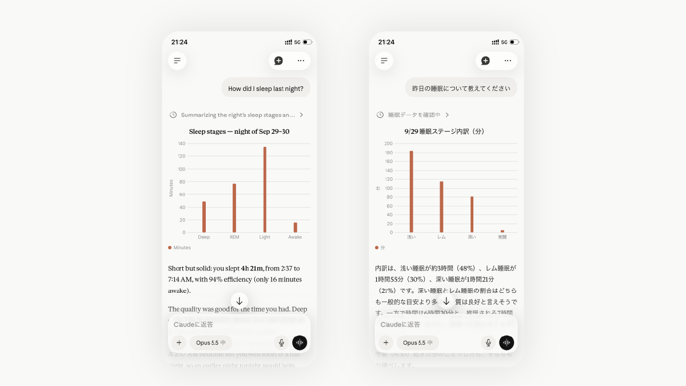
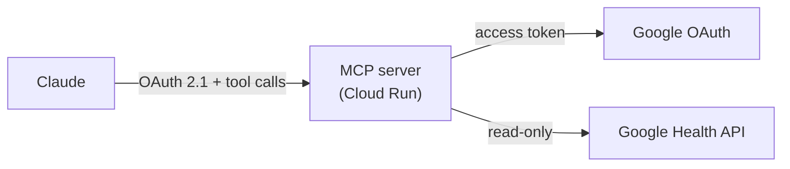
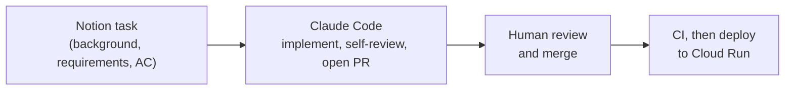

# google-health-mcp



**A remote MCP server that lets Claude read your Google Fitbit Air health data through the Google Health API.**

[](https://github.com/ryotanakata/google-health-mcp/actions/workflows/ci.yml)


[日本語版はこちら](README.ja.md)

---

Ask Claude "How did I sleep last night?" and this server fetches the data from the Google Health API, summarizes it, and returns it. Fitbit and Pixel Watch data works too.

## Architecture



- The server is also the OAuth 2.1 authorization server for Claude. It issues tokens only after you enter your passphrase (`MCP_SHARED_SECRET`) on its consent screen
- It is stateless: tokens are signed JWTs, so no database is needed
- It returns summaries, not raw time series

## MCP Tools

| Tool | Arguments | Returns |
| --- | --- | --- |
| `get_daily_activity` | `date` | Steps, calories, distance, active minutes |
| `get_sleep_log` | `date` | Sleep that ended that morning: duration, efficiency, stages, naps |
| `get_heart_rate_summary` | `date` | Resting heart rate, minutes in the moderate / vigorous / peak zones and their total |
| `get_exercise_history` | `start_date`, `end_date` | Workouts: type, time, calories, average heart rate, distance |

Dates are `YYYY-MM-DD`; ranges include both ends and are limited to 366 days.

## Data Constraints

- One request covers up to 90 days (14 days for multi-day heart rate and calorie aggregates). Longer ranges are split and merged
- Results are paged (25 per page for workouts and sleep) and fetched to the end
- The light heart rate zone is not returned: the daily rollup assigns every minute of the day to a zone, so light also holds sleep, rest, and time the device was not worn
- Google's own scores (Sleep Score, Daily Readiness) are not available through the API
- Sleep and workout start/end times are in the local time zone recorded with each session
- Tested with a real Google Fitbit Air account. Google Health Premium is not assumed, but whether every data type is available without it has not been checked

## Quick Start

First create an OAuth client and get `client_secret.json` (steps 1–2 of [docs/deployment.md](docs/deployment.md)).

```bash
pip install -r requirements-dev.txt
cp .env.example .env                                     # fill in the values
python auth_setup.py --client-secret client_secret.json  # get GOOGLE_REFRESH_TOKEN
python -m src.main                                       # http://localhost:8080/mcp
```

| Variable | Description |
| --- | --- |
| `PUBLIC_BASE_URL` | Public origin of the server |
| `MCP_SHARED_SECRET` | Consent screen passphrase (long random value) |
| `MCP_TOKEN_SIGNING_KEY` | Token signing key (random value of 32+ characters, different from the passphrase; changing it revokes all tokens) |
| `GOOGLE_CLIENT_ID` / `GOOGLE_CLIENT_SECRET` | GCP OAuth client |
| `GOOGLE_REFRESH_TOKEN` | Output of `auth_setup.py` |

## Deploy

1. In Google Cloud, enable the Google Health API, set up the OAuth consent screen with the read-only scopes, and get `client_secret.json`
2. Run `auth_setup.py` locally and store the secrets in Secret Manager
3. Deploy to Cloud Run with `PUBLIC_BASE_URL` set to the service URL (`https://<service>-<project-number>.<region>.run.app`)
4. In Claude: Settings → Connectors → Add custom connector → `https://<service>.run.app/mcp`, then enter the passphrase on the consent screen

While the consent screen stays in Testing, the Google refresh token expires after 7 days; renew it with `scripts/refresh_google_token.sh`. Step-by-step commands, continuous deployment on merge to `main`, and token renewal are in [docs/deployment.md](docs/deployment.md).

## Development

```bash
ruff check .
pytest
```

Tasks are written in Notion, implemented by Claude Code, and merged by a human. The setup lives in `.claude/`:



- `rules/`: coding conventions. The `rules-review` skill checks changed files against them, and a hook (`hooks/review-gate.sh`) blocks commits that have not passed
- `routine-prompt.md`: prompt for a scheduled routine. Each run handles one item: CI failures or review comments on its open PRs first, otherwise a new task from the Notion database in `notion.json`
- `skills/ship/`: review, commit, and open a PR in one step

## License

MIT
