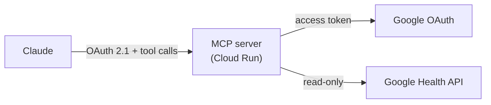

# google-health-mcp

**A remote MCP server that lets Claude read your Google Fitbit Air health data through the Google Health API.**

[](https://github.com/ryotanakata/google-health-mcp/actions/workflows/ci.yml)


[日本語版はこちら](README.ja.md)

---

Ask Claude "How did I sleep last night?" and this server fetches the data from the Google Health API, summarizes it, and returns it. Fitbit and Pixel Watch data works too.

## Architecture



- The server is also the OAuth 2.1 authorization server for Claude. It issues tokens only after you enter your passphrase (`MCP_SHARED_SECRET`) on its consent screen
- It is stateless: tokens are signed JWTs, so no database is needed
- It returns summaries, not raw time series

## MCP Tools

| Tool | Arguments | Returns |
| --- | --- | --- |
| `get_daily_activity` | `date` | Steps, calories, distance, active minutes |
| `get_sleep_log` | `date` | Sleep that ended that morning: duration, efficiency, stages, naps |
| `get_heart_rate_summary` | `date` | Resting heart rate, time in heart rate zones |
| `get_exercise_history` | `start_date`, `end_date` | Workouts: type, time, calories, average heart rate, distance |

Dates are `YYYY-MM-DD`; ranges include both ends.

## Data Constraints

- One request covers up to 90 days (14 days for multi-day heart rate and calorie aggregates). Longer ranges are split and merged
- Results are paged (25 per page for workouts and sleep) and fetched to the end
- Google's own scores (Sleep Score, Daily Readiness) are not available through the API
- Google Health Premium is not assumed. Access without it has not yet been verified on a real device

## Quick Start

```bash
pip install -r requirements-dev.txt
cp .env.example .env                                     # fill in the values
python auth_setup.py --client-secret client_secret.json  # get GOOGLE_REFRESH_TOKEN
python -m src.main                                       # http://localhost:8080/mcp
```

| Variable | Description |
| --- | --- |
| `PUBLIC_BASE_URL` | Public origin of the server |
| `MCP_SHARED_SECRET` | Consent screen passphrase (long random value; changing it revokes all tokens) |
| `GOOGLE_CLIENT_ID` / `GOOGLE_CLIENT_SECRET` | GCP OAuth client |
| `GOOGLE_REFRESH_TOKEN` | Output of `auth_setup.py` |

## Deploy

1. In Google Cloud, enable the Google Health API, set up the OAuth consent screen with the read-only scopes, and download `client_secret.json`
2. Run `auth_setup.py` locally and store the secrets in Secret Manager
3. Deploy to Cloud Run, then set the issued URL as `PUBLIC_BASE_URL` and deploy again
4. In Claude: Settings → Connectors → Add custom connector → `https://<your-service>.run.app/mcp`, then enter the passphrase on the consent screen

## Development

```bash
ruff check .
pytest
```

Coding conventions live in `.claude/rules/`. Commits pass a rules review first (`rules-review` skill).

## License

MIT
